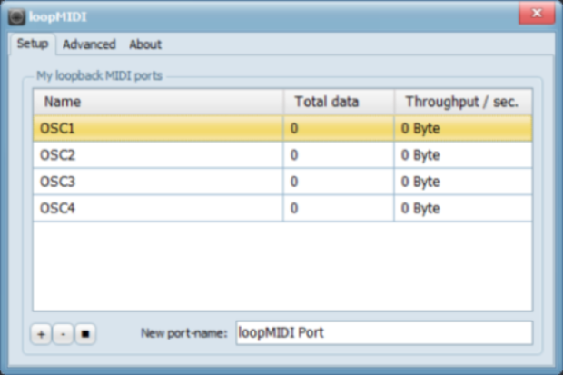
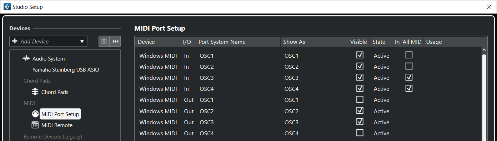
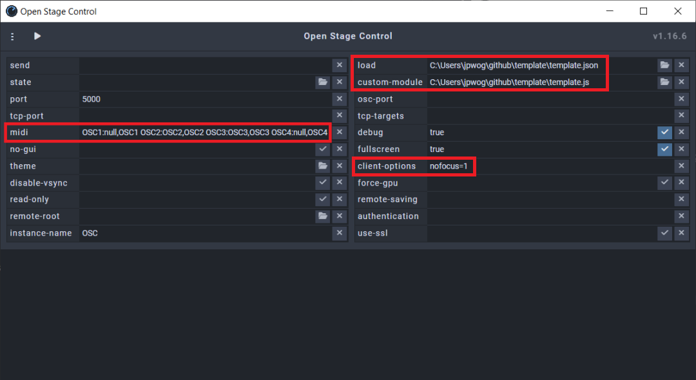
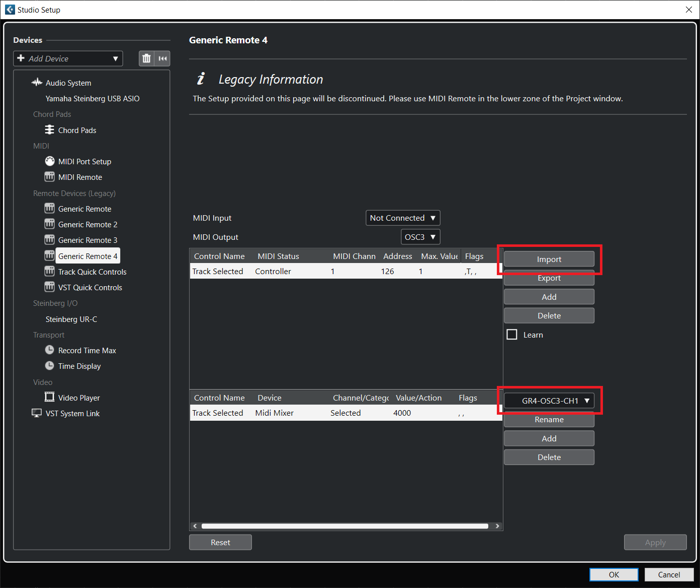
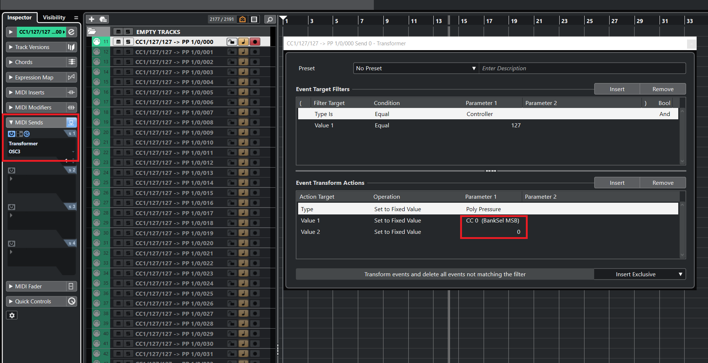

# Template.io

[](https://github.com/jpwogaman/template.io/LICENSE) 

---
## Getting Started

There are a two main paths you can take with this application depending on how you want to use it:

A. If you simply want to keep track of a large template of orchestral VSTs and other sample libraries, then download the Template.io binary for your system and say goodbye to that hideous Microsoft Excel document, you're all set!

B. If you want to keep track of your template AND have a touchscreen application update the available parameters for your tracks in real-time as you select them in Cubase, then you'll need to take a couple more steps.

1. Download [Open Stage Control](https://github.com/jean-emmanuel/open-stage-control.git)
2. If on MAC, use your IAC driver to create 4 virtual MIDI ports named OSC1, OSC2, OSC3, and OSC4
3. If on PC, download [loopMIDI](https://www.tobias-erichsen.de/software/loopmidi.html) and create the same 4 virtual MIDI ports

    

4. Set up the MIDI ports in both Open Stage Control and Cubase. For Open Stage Control you can paste the following into the MIDI input:
    ```JS      
    OSC1:null,OSC1 OSC2:OSC2,OSC2 OSC3:OSC3,OSC3 OSC4:null,OSC4
    ``` 
    ```JS
    //port1:input,output port2:input,output
    ```
    For Cubase setup your ports up match:

    

    The in/out configuration works like this:
    
    


5. Save the 'template.json' and the 'template.js' file from this repository to your preferred location and set that location in the 'load' and 'custom-module' inputs, respectively, for Open Stage Control. 

     *Note: if you are already using Open Stage Control and have a work file setup, I still recommend going through these steps to see how the system works. There is more information below on bringing in the elements of this custom-module to your own projects.*

    If you use a touchscreen that is connect via USB (as opposed to a tablet using WIFI), make sure to add the following to the 'client-options' input:
    ```
    nofocus=1
    ```
    
6. Open the 'template.js' file in a text editor and on the first line, set your preferred location for your 'tracks.json' file. Save the file. 
    ```JS
    const allTrack_jsn = loadJSON('../template/tracks.json');
    ```
7. Download the Template.io binary for your system and go to the settings to set your preferred location for your 'tracks.json' file as the SAME location that you indicated in 'template.js'
8. Back in Cubase, create a Generic Remote and import 'GR4-OSC3-CH1.xml' from this repository. This tells Cubase to transmit **Control Code 126 at Value 1 on Channel 1 on Port OSC3** every time a MIDI track is selected. Because of our custom-module, every time Open Stage Control receives this exact MIDI signal, it will send **Control Code 127 at Value 127 on Channel 1 on Port OSC4** back to Cubase. 

    

9. Start naming and routing your MIDI tracks as you normally would, however, be sure to add and setup a transformer on the MIDI sends for the track. This will receive the signal that Open Stage Control just sent (in response to the signal Cubase sent when the track was selected) and return a **Polyphonic Key Pressure signal on port OSC3** that is completely unique to every track. 


    I know this seems like a hassle, so I took the liberty of setting up these transformers on over 2,000 empty MIDI tracks so wouldn't have to! I recommend you import these into your template (or just use the file provided to start a new one). These tracks are in the 'template-io-empty-tracks.cpr' file and are all disabled for you to activate anytime you wish to add a new instrument.

    

10. Start using Template.io to add information about your tracks and when you save, it will automatically update the 'tracks.json' file that the custom-module is reading from. This will update your instance of Open Stage Control and put all of the parameters that each track can use right at the tip of your fingers. For the time being, since there is no MIDI send feature on instrument tracks, audio tracks, or any other track other than MIDI tracks, your template will have to primarily use MIDI tracks routed to instrument tracks or a hosting companion such as Vienna Ensemble Pro.

---
## Running Template.io from Source

[**Tauri Prerequisites**](https://tauri.app/v1/guides/getting-started/prerequisites) - this includes downloading Rust, as well as configuring your PATH. 

```
git clone https://github.com/jpwogaman/template.io
```
```
cd template.io
```
```
npm install
```
```
npm run tauri dev
```

## Technologies Used


| Component                                                                 | Version                                                                                                                               | 
| ------------------------------------------------------------------------- | ------------------------------------------------------------------------------------------------------------------------------------- | 
| [**Tauri**](https://github.com/tauri-apps/tauri)                          | [](https://github.com/tauri-apps/tauri)                   |
| [**React**](https://github.com/facebook/react)                            | [](https://github.com/facebook/react)                                |
| [**tailwindcss**](https://github.com/tailwindlabs/tailwindcss)            | [](https://github.com/tailwindlabs/tailwindcss)                |
