# Template.io

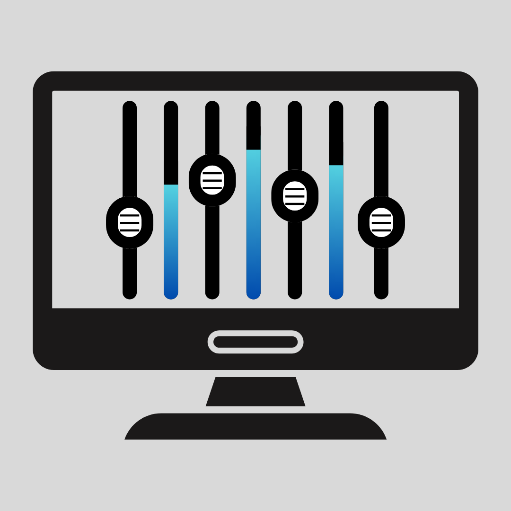

[](https://github.com/jpwogaman/template.io/blob/main/LICENSE)

# Table of Contents

[How To Use Template.io Standalone](#how-to-use-templateio-standalone)

1. [Install Template.io](#1-install-templateio)
   - [Option A. Download the Binary (coming soon)](#option-a-download-the-binary-coming-soon)
   - [Option B. Build Template.io from Source](#option-b-build-templateio-from-source)
     - [1. Configure Requirements (Windows)](#1-configure-requirements-windows)
     - [2. Build Template.io](#2-build-templateio)
     - [3. Update Template.io from Source](#3-update-templateio-from-source)
2. [Launch Template.io](#2-launch-templateio)
   - [Explanation of Layout](#explanation-of-layout)
3. [Editing Tracks](#3-editing-tracks)
   - [1. Main Track Information](#1-main-track-information)
   - [2. Context Menu](#2-context-menu)
4. [Editing Sub-Items](#4-editing-sub-items)
   - [1. Instrument Ranges](#1-instrument-ranges)
   - [2. Articulations (Toggle)](#2-articulations-toggle)
   - [3. Articulations (Tap)](#3-articulations-tap)
   - [4. Additional Layers](#4-additional-layers)
   - [5. Faders](#5-faders)
   - [6. Context Menu](#6-context-menu)
5. [Editing Settings](#5-editing-settings)
6. [Import, Export, and Flush DB](#6-import-export-and-flush-db)

[How To Use Template.io with Open Stage Control and Cubase](#how-to-use-templateio-with-open-stage-control-and-cubase)

1. [Download the Custom Module and Generic Remote Files](#1-download-the-custom-module-and-generic-remote-files)
2. [Follow the Instructions Above to Download and Setup Template.io](#2-follow-the-instructions-above-to-download-and-setup-templateio)
3. [Setup MIDI Ports](#3-setup-midi-ports)
4. [Download Open Stage Control](#4-download-open-stage-control)
   - [Option A. Download .zip (recommended)](#option-a-download-zip-recommended)
   - [Option B. Build Open Stage Control From Source](#option-b-build-open-stage-control-from-source)
     - [1. Configure Open Stage Control Requirements (Windows)](#1-configure-open-stage-control-requirements-windows)
     - [2. Build Open Stage Control](#2-build-open-stage-control)
     - [3. Update Open Stage Control from Source](#3-update-open-stage-control-from-source)
     - [4. Package an Open Stage Control Binary (Windows)](#4-package-an-open-stage-control-binary-windows)
5. [Launch Open Stage Control](#5-launch-open-stage-control)
   - [Option A. Launch from Executable](#option-a-launch-from-executable)
   - [Option B. Launch from Terminal](#option-b-launch-from-terminal)
   - [Option C. How JP Launches Open Stage Control](#option-c-how-jp-launches-open-stage-control)
   - [Explanation of Layout](#explanation-of-layout)
6. [Setup Cubase](#6-setup-cubase)
   - [1. Assign MIDI ports](#1-assign-midi-ports)
   - [2. Add Generic Remote](#2-add-generic-remote)
7. [Build Your Template!](#7-build-your-template)
   - [1. Create Tracks](#1-create-tracks)
   - [2. For Each Track, Add a Transformer on the MIDI Sends with Port OSC3](#2-for-each-track-add-a-transformer-on-the-midi-sends-with-port-osc3)
   - [3. Bonus! Empty Tracks](#3-bonus-empty-tracks)
8. [Custom Module in Action](#8-custom-module-in-action)

# How To Use Template.io Standalone

## 1. Install Template.io

### Option A. Download the Binary (coming soon)

### Option B. Build Template.io from Source

#### 1. Configure Requirements (Windows)

Requirements 1-3 are pulled from [**Tauri Prerequisites**](https://v2.tauri.app/start/prerequisites/).

1. [**Microsoft C++ Build Tools**](https://visualstudio.microsoft.com/visual-cpp-build-tools/)

   a. Download the Microsoft C++ Build Tools installer and open it to begin installation.

   b. During installation check the “Desktop development with C++” option.

2. [**WebView2**](https://developer.microsoft.com/en-us/microsoft-edge/webview2/#download-section)

   a. already installed on Windows 10 (from version 1803 onward) and later versions of Windows.

3. [**Rust**](https://www.rust-lang.org/tools/install)

4. [**Git**](https://git-scm.com/downloads)

5. [**Node.js**](https://nodejs.org/en/download/) - **_Only version 18.20.x currently works_**

6. [**pnpm**](https://pnpm.io/installation) - **_Only version 9.15.x currently works_**

#### 2. Build Template.io

In a command prompt or terminal, navigate to the directory where you would like to download the repository and run the following commands:

1.  ```
    git clone https://github.com/jpwogaman/template.io.git
    ```
2.  ```
    cd template.io
    ```
3.  ```
    pnpm install
    ```
4.  ```
    pnpm tauri build
    ```

The binary should build relative to the repository:

**_C:\PATH\TO\template.io\src-tauri\target\release\template-io.exe_**

#### 3. Update Template.io from Source

If you have already cloned the repository and would like to update it, navigate to the root of the repository in a command prompt or terminal and run the following commands:

1.  ```
    git pull
    ```
2.  ```
    pnpm install
    ```
3.  ```
    pnpm tauri build
    ```

## 2. Launch Template.io

1. Navigate to where you downloaded template-io.exe (e.g., C:\Users\USERNAME\Downloads\template-io.exe), or to where you built it from source (e.g., C:\PATH\TO\template.io\src-tauri\target\release\template-io.exe), and launch the app.
2. Upon the very first startup, Template.io will generate a new directory relative to your systems' home directory (_on Windows, this will be C:\Users\USERNAME\template.io_) containing two files:
   1. settings.json
   2. database.sqlite

> **⚠️ Do not move or delete these files while Template.io is running, as this will cause the app to crash. If you do, simply restart the app and it will generate new files. However, if you do delete these files, you will lose all of your data.**

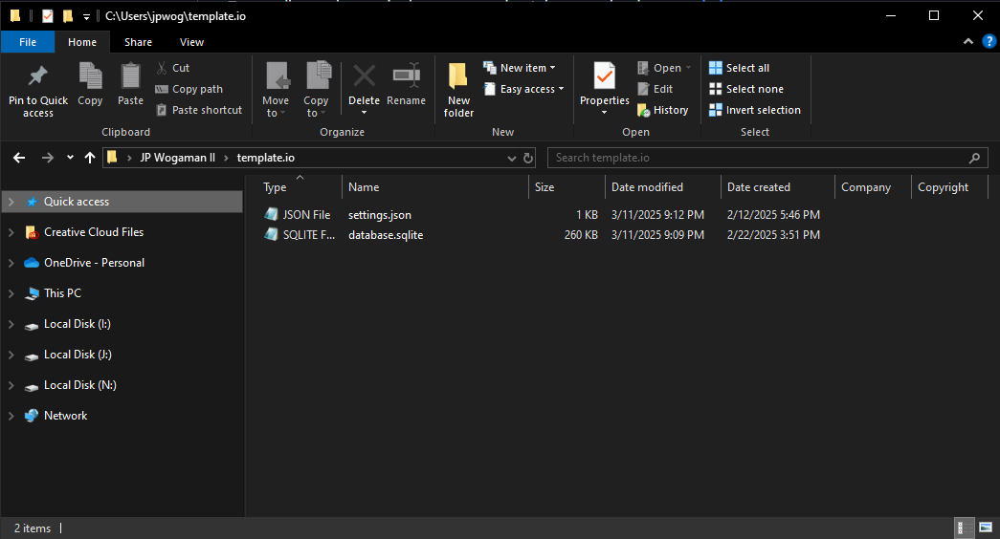

### Explanation of Layout

Now that we've successfully launched Template.io, let's go over the layout of the app. This is what you will see when you first open the app:

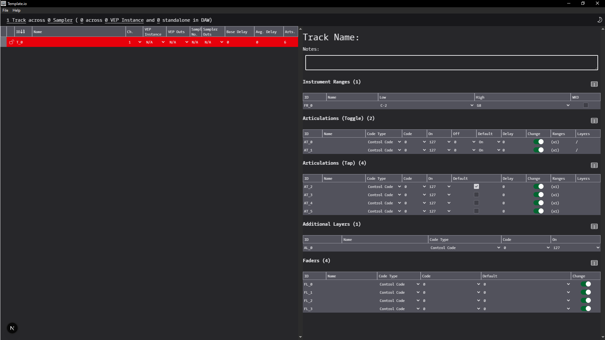

The app is divided into two sections:

1. **Track List** on the left side - This is where you will see all of your tracks. You can add, edit, and delete tracks from this list.
2. **Track Details** on the right side - This is where you will see all of the details for the selected track. The Track Details are split into five sub-sections and the default number of sub-items for a new track can be adjusted in the settings.

   1. Instrument Ranges
   2. Articulations (Toggle)
   3. Articulations (Tap)
   4. Additional Layers
   5. Faders

The sub-items in the Track Details can be displayed as either a table or as cards by clicking on the icon above the section.

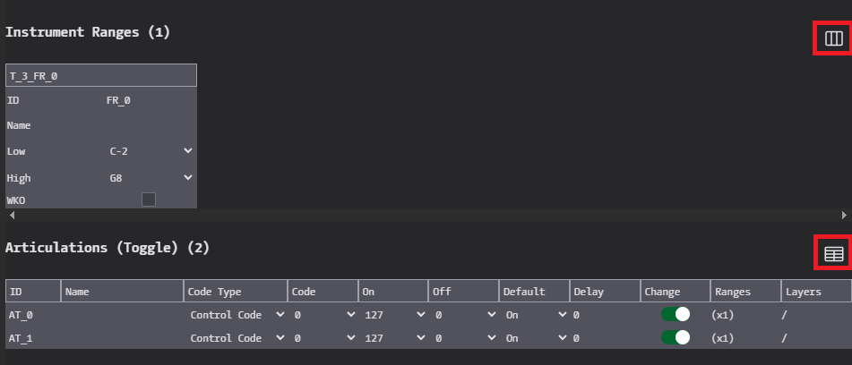

## 3. Editing Tracks

### 1. Main Track Information

- `color: string` track color
- `locked: boolean` prevents editing or deleting the track
- `id: T_{number}` unique and not editable
- `name: string`
- `channel: number` 1-16, corresponds to a MIDI channel
- `vep_instance: string` the name of the instance if using VEP,
  - _TBD ADJUSTABLE IN SETTINGS_
- `vep_out: string` the set of main outputs in VEP if using VEP, the number of available outputs can be adjusted in the settings
- `smp_number: string` the number of the sampler if using VEP
  - _TBD ADJUSTABLE IN SETTINGS_
- `smp_out: string` the set of outputs in the sampler if using VEP, the number of available outputs can be adjusted in the settings
- `base_delay: number` the positive or negative track delay in ms
- `avg_delay: number` not editable, average of all articulation delays (in ms) if they differ from the base delay
- `arts: number` not editable and not part of actual schema, this is a count of all of the articulations in the Track Details
- `notes: string` editable in the Track Details

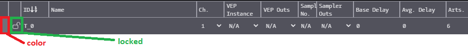

### 2. Context Menu

#### _Move a Track Up (coming soon)_

#### _Move a Track Down (coming soon)_

#### _Add Tracks Above Currently Selected Track (coming soon)_

#### _Add Tracks Below Currently Selected Track (coming soon)_

#### Add Tracks At End of Track List

To add a track, right-click on a track in the list and select "Add # Track At End". To change the number of tracks you want to add, adjust the number in the input box. This can also be adjusted in the settings.

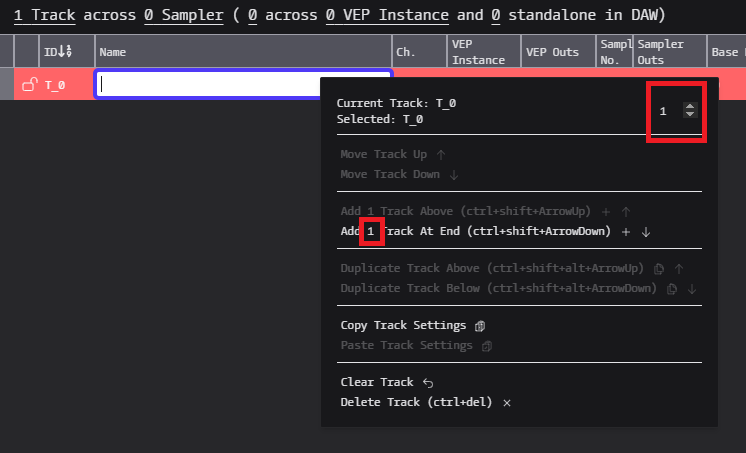

#### _Duplicate Track Above Currently Selected Track (coming soon)_

#### _Duplicate Track Below Currently Selected Track (coming soon)_

#### _Duplicate Track At End of Track List (coming soon)_

#### Copy Track Settings

#### _Paste Track SetTings (coming soon)_

#### Clear a Track

#### Delete a Track

## 4. Editing Sub-Items

### 1. Instrument Ranges

- `id: T_{number}_FR_{number}` unique and not editable
- `name: string`
- `low: string` note names, with "Middle C" being C3
  - _TBD ADJUSTABLE IN SETTINGS_, but "Middle C" is always Note 60
- `high: number` note names, with "Middle C" being C3
  - _TBD ADJUSTABLE IN SETTINGS_, but "Middle C" is always Note 60
- `white_keys_only: boolean`

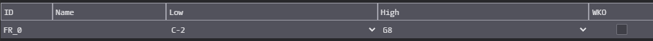

### 2. Articulations (Toggle)

- `id: T_{number}_AT_{number}` unique and not editable
- `name: string`
- `code_type: string` these correlate to Open Stage Control addresses
- `code: number`

  - _TBD number ranges will change depending on code_type_, currently:
    - if `code_type = /control`, then `code: 0-127`
    - if `code_type = /note`, then `code: 0-127`

- `on: number` 0-127

- `off: number` 0-127
- `default: string`
- `delay: number` the track delay (in ms) when this articulation is active
- `change_type: string`
  - _TBD actually employing this logic in the Open Stage Control custom module._ Current logic is the Value 2 logic but the options would be:
    - Value 1 = the ON and OFF values relate to the CODE itself (i.e. ON = CC18, OFF = CC35)
    - Value 2 = the ON and OFF values relate to the CODE's second Value (i.e. CODE = C#3, ON = Velocity 20, OFF = Velocity 21)
- `ranges: string` list of Instrument Range ids, there must always be one Instrument Range linked to every Articulation (Tap or Toggle)
- `art_layers_on: string` list of Additional Layer ids, these will fire all together in the Open Stage Control custom module
- `art_layers_off: string` list of Additional Layer ids, these will fire all together in the Open Stage Control custom module

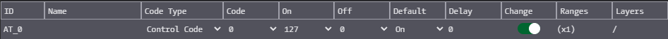

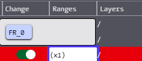

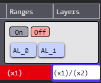

### 3. Articulations (Tap)

- `id: T_{number}_AT_{number}` unique and not editable, the count will always start after the last Toggle Articulation
- `name: string`
- `code_type: string` these correlate to Open Stage Control addresses
- `code: number`
  - _TBD number ranges will change depending on code_type_, currently:
    - if `code_type = /control`, then `code: 0-127`
    - if `code_type = /note`, then `code: 0-127`
- `on: number` 0-127
- `default: boolean` only one Tap Articulation may be default
- `delay: number` the track delay (in ms) when this articulation is active
- `change_type: string`
  - _TBD actually employing this logic in the Open Stage Control custom module._ Current logic is the Value 2 logic but the options would be:
    - Value 1 = the ON value relates to the CODE itself (e.g. ON = CC18)
    - Value 2 = the ON value relates to the CODE's second Value (e.g. CODE = C#3, ON = Velocity 20)
- `ranges: string` list of Instrument Range ids, there must always be one Instrument Range linked to every Articulation (Tap or Toggle)
- `art_layers: string` list of Additional Layer ids
- `layers_together: boolean` whether Additional Layers fire all together or one-at-a-time in the custom module.
- `default_layer: string` default Additional Layer if the layers fire one-at-a-time, only one layer may be default. If no default layer is selected, the Open Stage Control custom module will use the first layer in the list for the default.

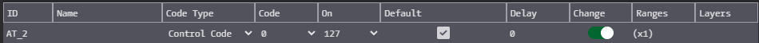

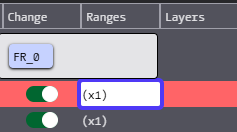

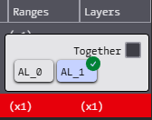

### 4. Additional Layers

- `id: T_{number}_AL_{number}` unique and not editable
- `name: string`
- `code_type: string` these correlate to Open Stage Control addresses
- `code: number`
  - _TBD number ranges will change depending on code_type_, currently:
    - if `code_type = /control`, then `code: 0-127`
    - if `code_type = /note`, then `code: 0-127`
- `on: number` 0-127

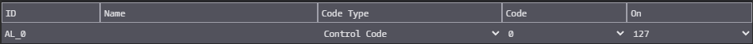

### 5. Faders

- `id: T_{number}_FL_{number}` unique and not editable
- `name: string`
- `code_type: string` these correlate to Open Stage Control addresses
- `code: number`
  - _TBD number ranges will change depending on code_type_, currently:
    - if `code_type = /control`, then `code: 0-127`
    - if `code_type = /note`, then `code: 0-127`
- `default: number` 0-127
- `change_type: string`
  - _TBD actually employing this logic in the Open Stage Control custom module._ Current logic is the Value 2 logic but the options would be:
    - Value 1 = the DEFAULT value relates to the CODE itself (e.g. DEFAULT = CC11)
    - Value 2 = the DEFAULT value relates to the CODE's second Value (e.g. CODE = C#3, DEFAULT = Velocity 20)

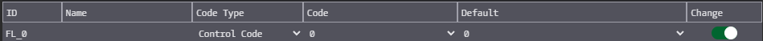

### 6. Context Menu

#### _Move a Sub-Item Up (coming soon)_

#### _Move a Sub-Item Down (coming soon)_

#### _Add Sub-Items Above Currently Selected Sub-Item (coming soon)_

#### _Add Sub-Items Below Currently Selected Sub-Item (coming soon)_

#### Add Sub-Items At End of Sub-Items List

To add a sub-item, right-click on a sub-item and follow the same procedure as above for tracks. The number input for adding sub-items is independent from the number input for adding tracks, and can also be adjusted in the settings.


#### _Duplicate Sub-Item Above Currently Selected Sub-Item (coming soon)_

#### _Duplicate Sub-Item Below Currently Selected Sub-Item (coming soon)_

#### _Duplicate Sub-Item At End of Sub-Item List (coming soon)_

#### Copy Sub-Item Settings

#### _Paste Sub-Item SetTings (coming soon)_

#### _Clear a Sub-Item (coming soon)_

#### Delete a Sub-Item

## 5. Editing Settings

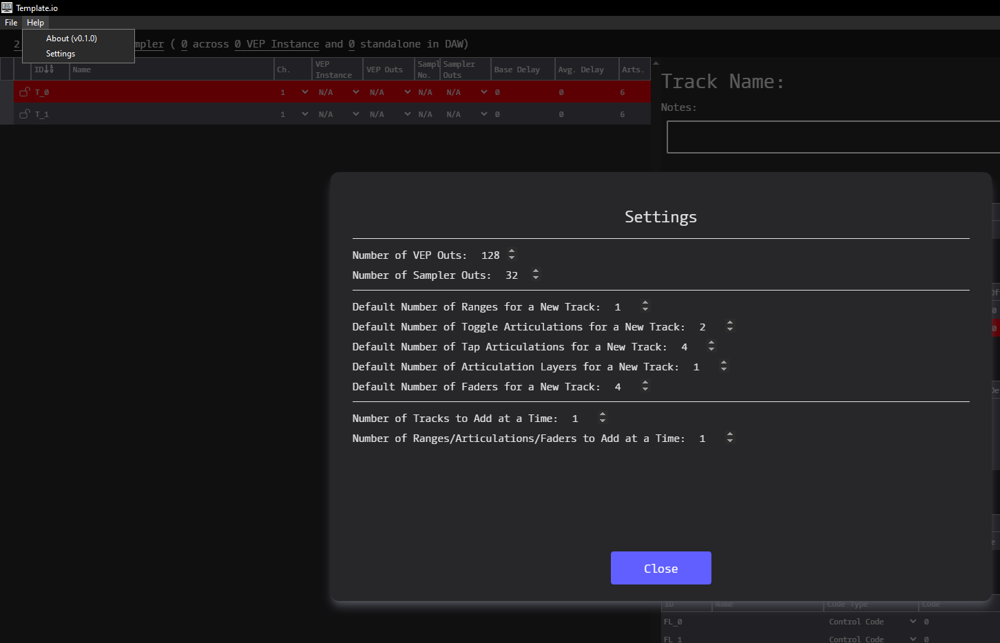

## 6. Import, Export, and Flush DB

Template.io imports and exports JSON files with this schema (TBD).

**_Importing a new track list will overwrite the database.sqlite file referenced above. Clicking "Flush DB / Clear All", and it will also clear the database.sqlite file, and will go back to the initial 1 track and the settings-defined default number of sub-items._**

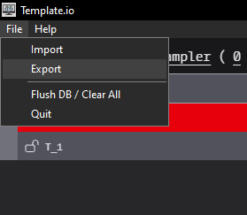

# How To Use Template.io with Open Stage Control and Cubase

## 1. Download the Custom Module and Generic Remote Files

1. /assets/for-osc/**template-io-workfile.json**
2. /assets/for-osc/**template-io-custom-module.js**
3. /assets/for-cubase/**template-io-generic-remote.xml**
4. /assets/for-cubase/**template-io-empty-tracks.cpr**

## 2. Follow the Instructions Above to Download and Setup Template.io

Once you have exported a track list, you must now add it to top of the **template-io-custom-module.js** file.

```js
const allTrack_jsn = loadJSON('YOUR_TRACK_LIST.json')
```

## 3. Setup MIDI Ports

1. For Mac, use your IAC driver to create 4 virtual MIDI ports named OSC1, OSC2, OSC3, and OSC4
2. For Windows, download [**loopMIDI**](https://www.tobias-erichsen.de/software/loopmidi.html) and create the same 4 virtual MIDI ports

   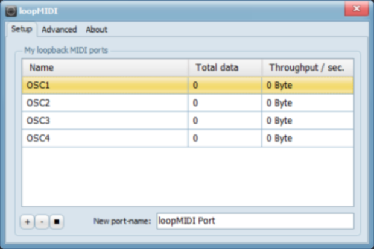

## 4. Download Open Stage Control

### Option A. Download .zip (recommended)

Navigate to [**Open Stage Control**](https://github.com/jean-emmanuel/open-stage-control/releases/) and download the most recent **open-stage-control_X.XX.X_win32-x64.zip** file.

### Option B. Build Open Stage Control From Source

#### 1. Configure Open Stage Control Requirements (Windows)

Requirements 1-2 are pulled from [**Running from sources**](https://openstagecontrol.ammd.net/docs/getting-started/running-from-sources/).
Requirements 3-4 are pulled from [**MIDI configuration**](https://openstagecontrol.ammd.net/docs/midi/midi-configuration/#__tabbed_1_2)

1. [**Git**](https://git-scm.com/downloads)

2. [**Node.js**](https://nodejs.org/en/download/) - **version 16 and above**

3. [**python 3**](https://www.python.org/downloads/windows/)

4. [**python package python-rtmidi**](https://spotlightkid.github.io/python-rtmidi/installation.html#from-pypi)

#### 2. Build Open Stage Control

In a command prompt or terminal, navigate to the directory where you would like to download the repository and run the following commands:

1.  ```
    git clone https://github.com/jean-emmanuel/open-stage-control
    ```
2.  ```
    cd open-stage-control/
    ```
3.  _Optional! Only if you want the latest release instead of the current development version._
    ```
    git checkout $(git describe --tags `git rev-list --tags --max-count=1`)
    ```
4.  ```
    npm install
    ```
5.  ```
    npm run build
    ```

#### 3. Update Open Stage Control from Source

If you have already cloned the repository and would like to update it, navigate to the root of the repository in a command prompt or terminal and run the following commands:

1.  ```
    git pull
    ```
2.  ```
    npm install
    ```
3.  ```
    npm run build
    ```

#### 4. Package an Open Stage Control Binary (Windows)

If you would like to package an executable as opposed to running from a command prompt, you can open a command prompt or terminal, navigate to the root of the repository and run:

1. ```
   export PLATFORM=win32
   ```
2. ```
   export ARCH=x64
   ```
3. ```
   npm run package
   ```

The binary should build relative to the repository:

**_C:\PATH\TO\open-stage-control\dist\open-stage-control-win32-x64\open-stage-control.exe_**

## 5. Launch Open Stage Control

### Option A. Launch from Executable

When you launch the executable, a launcher GUI will pop-up. Add the locations for the **template-io-workfile.json** and the **template-io-custom-module.js** files in the 'load' and 'custom-module' inputs, respectively.

Add the MIDI ports that we created above by pasting the following into the MIDI input:

```JS
OSC1:-1,OSC1 OSC2:OSC2,OSC2 OSC3:OSC3,OSC3 OSC4:-1,OSC4
//device_name:input,output
//-1 will bypass the input/output
```

The in/out configuration works like this:

| Open Stage Control |        | Cubase   | Cubase "In All MIDI" |
| ------------------ | ------ | -------- | -------------------- |
| **OSC1**           | **→**  | **OSC1** | No                   |
| **OSC2**           | **↔** | **OSC2** | No                   |
| **OSC3**           | **↔** | **OSC3** | Yes                  |
| **OSC4**           | **→**  | **OSC4** | Yes                  |

Also, if you use a touchscreen that is connect via USB (as opposed to a tablet using WIFI), I recommend that you add `nofocus=1` to the 'client-options' input.

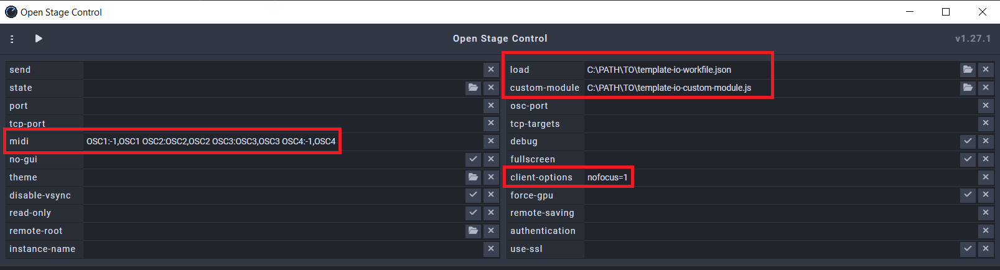

### Option B. Launch from Terminal

If you have built Open Stage Control from source, you can open a command prompt or terminal, navigate to the root of the repository and run:

Option 1.

```
npm start
```

Option 2.

```
npm start [ -- options]
```

If you add the [-- options], the launcher GUI will **_not_** pop-up and you will need to pass all of the options in directly.

### Option C. How JP Launches Open Stage Control

I have a .BAT script similar to this one loaded on a Stream Deck, so I just press one button and skip the launcher GUI. Note that I am still using the built executable in this script, but in theory, you could still use `npm start`.

```bat
@echo off

set directory=C:\PATH\TO\open-stage-control\dist\open-stage-control-win32-x64
@REM set directory=C:\PATH\TO\open-stage-control
set workfile=C:\PATH\TO\template-io-workfile.json
set custom_module=C:\PATH\TO\template-io-custom-module.js
set midi=OSC1:-1,OSC1 OSC2:OSC2,OSC2 OSC3:OSC3,OSC3 OSC4:-1,OSC4
set client_options=nofocus=1

start "Open Stage Control" /d "%directory%" /min cmd /k "open-stage-control.exe -- --load %workfile% --custom-module %custom_module% --midi %midi% --client-options %client_options%"
@REM start "Open Stage Control" /d "%directory%" /min cmd /k "npm start -- --load %workfile% --custom-module %custom_module% --midi %midi% --client-options %client_options%"
```

### Explanation of Layout

Below is my personal template, located at **assets/jps-template/template-io-workfile.json**, with red boxes showing where Template.io maps to.

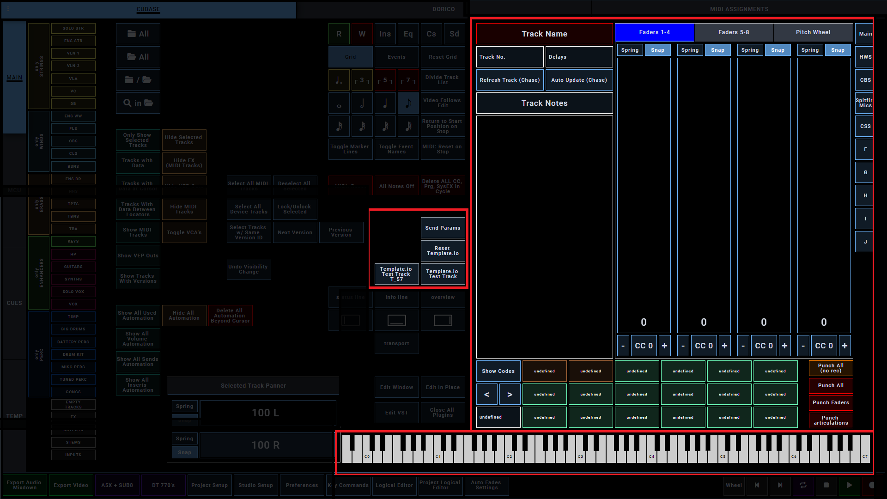

This is how it maps to the Template.io:

- Instrument Ranges

  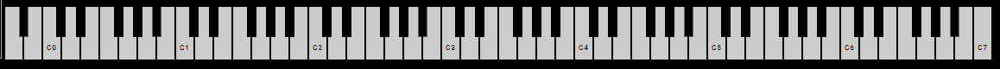

- Articulations (Toggle in brown, Tap in green)

  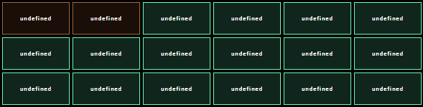

- Additional Layers

  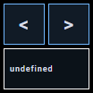

- Faders

  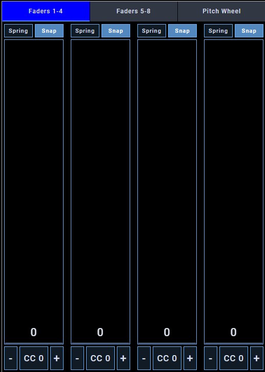

## 6. Setup Cubase

> **⚠️ Note: Template.io was built around Cubase version 11 and 12, it has not been tested on any of the later versions**

### 1. Assign MIDI ports

Now in Cubase, open Studio Setup to setup your MIDI ports to match the schema above.

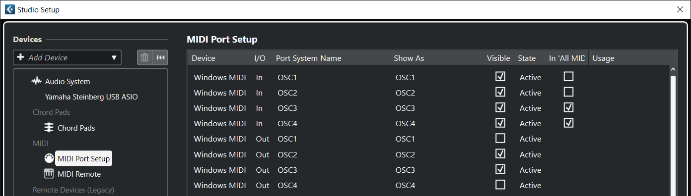

### 2. Add Generic Remote

1. Open Cubase and navigate to `Studio > Studio Setup`.
2. In the `Studio Setup` window, click on `Add Device` and select `Generic Remote`.
3. Set the `MIDI Output` to `OSC3`.
4. Click on `Import` and select the `template-io-generic-remote.xml` file.

This generic remote setup in Cubase is configured to transmit `Control Code 126 at Value 1 on Channel 1 on Port OSC3` every time a MIDI track is selected.

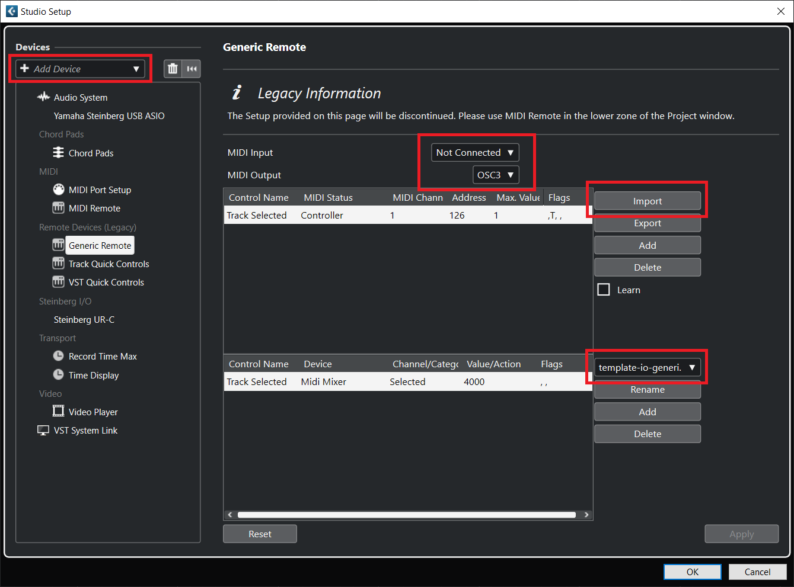

In our custom module, every time Open Stage Control receives this exact MIDI signal, it will send `Control Code 127 at Value 127 on Channel 1 on Port OSC4` back to Cubase.

```js
////// ln. 65-76

/**
 * @param {126} arg1_OSC3
 * @param {0 | 1} arg2_OSC3
 */
function toggles_OSC3(arg1_OSC3, arg2_OSC3) {
  if (arg1_OSC3 === 126 && arg2_OSC3 === 1) {
    toggleSendUpdate = true
  }
  if (arg1_OSC3 === 126 && arg2_OSC3 === 0) {
    toggleSendUpdate = false
  }
}

////// ln. 78-81

function sendUpdateCode() {
  send('midi', 'OSC4', '/control', 1, 127, 127)
}

////// ln. 196-206

if (port === 'OSC3' && address === '/control') {
  toggles_OSC3(arg1, arg2)
  if (toggleAutoUpdate && toggleSendUpdate) {
    sendUpdateCode()
    toggleSendUpdate = false
  }
}
```

## 7. Build Your Template!

> **⚠️ Note: Unfortunately, for the time being (as of Cubase v12.0.7), since there is no MIDI send feature on instrument tracks, audio tracks, or any other track other than MIDI tracks, your template will have to primarily use MIDI tracks routed to rack instrument tracks in Cubase or to Vienna Ensemble Pro.**

### 1. Create Tracks

Create empty MIDI tracks and start naming and routing them as you would normally. I personally name these verbatim what I have in my Template.io track list.

### 2. For Each Track, Add a Transformer on the MIDI Sends with Port OSC3

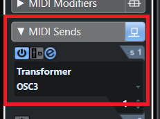

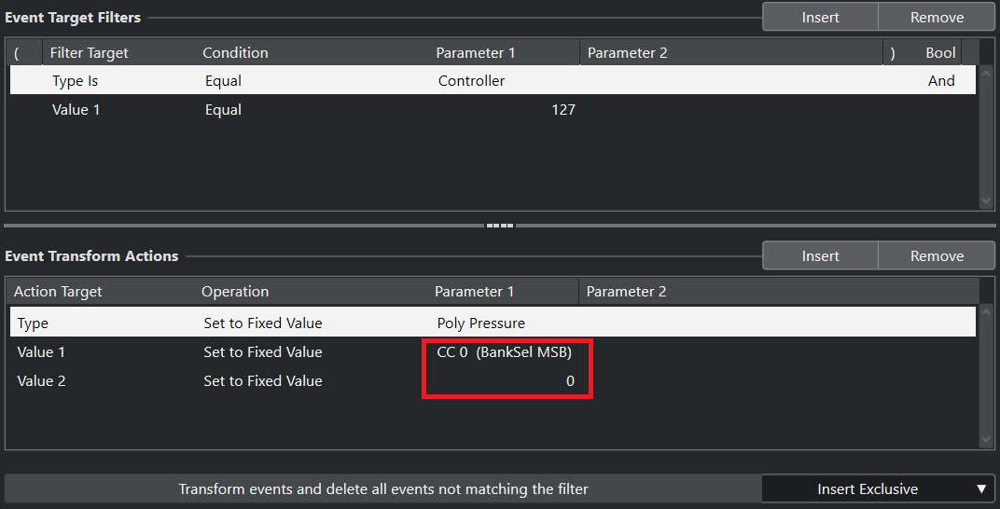

This will receive the signal that Open Stage Control just sent (in response to the signal Cubase sent when the track was selected) and return a `Polyphonic Key Pressure signal on port OSC3` that is completely unique to every track.

This number is calculated in the Custom Module like so:

```js
if (address !== '/key_pressure') return data

const trkNumb = arg1 * 128 + arg2

// address = "Poly Pressure" in the "Event Transform Actions" in the picture above
// arg1 = "Value 1" in the "Event Transform Actions" in the picture above
// arg2 = "Value 2" in the "Event Transform Actions" in the picture above
```

The `trkNumb` will reference the index of the tracks in the track list, which is ordered by the `T_{number}` id that every track is given.

```js
const track = items[trkNumb]
```

### 3. Bonus! Empty Tracks

I know adding transformers on each track seems like a hassle, so I took the liberty of setting up these transformers on **384** empty MIDI tracks so you wouldn't have to! These tracks are available in the **template-io-empty-tracks.cpr** file and are all disabled for you to activate anytime you wish to add a new instrument. I recommend you import these into your template, or use the file to start a new one.


## 8. Custom Module in Action

Okay let's make sure we have everything we need:

- Track List populated with track parameters and loaded into the Open Stage Control custom module
- Open Stage Control launched with correct MIDI ports
- Cubase MIDI ports setup with correct in/out configuration
- Cubase Generic Remote setup with correct MIDI ports
- MIDI tracks created with Transformers and unique Polyphonic Key Pressure Signal correctly mapped to the `T_{number}` id of every track in the Track List

Great! Now every time we select a track, Open Stage Control will populate the correct parameters for that track and we can now **_finally_** start writing music!


