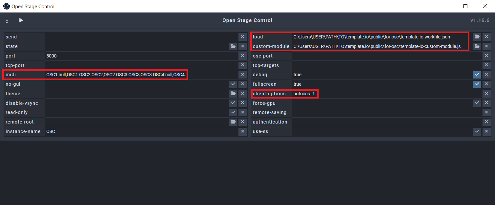

# Template.io

[](https://github.com/jpwogaman/template.io/blob/main/LICENSE) 


# Disclaimer: 

**This app is not complete and there are no binaries available yet.** That being said, please feel free to read the "Getting Started" text below, it does outline the reasoning behind this app, as well as what my goals are for this app. To actually use the app in the same way that I do currently, please see [**below**](#running-templateio-from-source).


# Getting Started 
There are a two main paths you can take with this application depending on how you want to use it:

A. If you simply want to keep track of a large template of orchestral VSTs and other sample libraries, then download the Template.io binary for your system and say goodbye to that hideous Microsoft Excel document, you're all set!

B. If you want to keep track of your template AND have a touchscreen application update the available parameters for your tracks in real-time as you select them in Cubase, then you'll need to take a couple more steps.

*Note: to my knowledge, this only works in real-time in Cubase. For users of other DAWs, you can still use Template.io to update relevant track data but for the time being this is search-based.*

## 1. Setup MIDI Ports

1. If on MAC, use your IAC driver to create 4 virtual MIDI ports named OSC1, OSC2, OSC3, and OSC4
2. If on PC, download [**loopMIDI**](https://www.tobias-erichsen.de/software/loopmidi.html) and create the same 4 virtual MIDI ports

    


## 2. Setup Template.io (eventually...)

Download the Template.io binary for your system, run the installer, and set your preferred location for the Template.io directory, which will automatically contain the following files (feel free to rename these):

1. template-io-track-data.json
2. template-io-workfile.json
3. template-io-custom-module.js
4. template-io-generic-remote.xml
5. template-io-empty-tracks.cpr

*Note: If you plan on running Template.io from source, then these files are already setup in the repository in 'template.io/public/for-cubase' and 'template.io/public/for-osc.' There is more information [**below**](#running-templateio-from-source) on making sure Template.io runs smoothly from source.*

## 3. Setup Open Stage Control
Download and launch [**Open Stage Control**](https://github.com/jean-emmanuel/open-stage-control.git). Add the locations for the **template-io-workfile.json** and the **template-io-custom-module.js** files in the 'load' and 'custom-module' inputs, respectively. 

Add the MIDI ports that we created above by pasting the following into the MIDI input:
```JS      
OSC1:null,OSC1 OSC2:OSC2,OSC2 OSC3:OSC3,OSC3 OSC4:null,OSC4
``` 
```JS
//port1:input,output port2:input,output
```
*Note: if you are already using Open Stage Control and have a your own ports, custom-module, workfile, etc. setup, I still recommend going through these steps to see how the system works. There is more information [**below**]() on bringing the elements of the workfile and custom-module into your own projects.*

Also, if you use a touchscreen that is connect via USB (as opposed to a tablet using WIFI), I recommend that you add the following to the 'client-options' input:
```
nofocus=1
```


The in/out configuration works like this:

| Open Stage Control |       | Cubase        | "In All MIDI" |
| ------------------ | ----- | ------------- | ------------- |
| **OSC1**           | **→** | **OSC1**      | No            |
| **OSC2**           | **↔** | **OSC2**      | No            |
| **OSC3**           | **↔** | **OSC3**      | Yes           |
| **OSC4**           | **→** | **OSC4**      | Yes           |


## 4. Setup Cubase

Now in Cubase, setup your MIDI ports to match the scheme above, create a new Generic Remote, and import **template-io-generic-remote.xml**. This tells Cubase to transmit Control Code 126 at Value 1 on Channel 1 on Port OSC3 every time a MIDI track is selected. Because of our custom-module, every time Open Stage Control receives this exact MIDI signal, it will send Control Code 127 at Value 127 on Channel 1 on Port OSC4 back to Cubase. 


## 5. Build Your Template! (evntually...)

*Note: Unfortunately, for the time being, since there is no MIDI send feature on instrument tracks, audio tracks, or any other track other than MIDI tracks, your template will have to primarily use MIDI tracks routed to instrument tracks or a hosting companion such as Vienna Ensemble Pro.*

Create empty MIDI tracks and start naming and routing them as you would normally, however, be sure to add a transformer on the MIDI sends for the track. This will receive the signal that Open Stage Control just sent (in response to the signal Cubase sent when the track was selected) and return a Polyphonic Key Pressure signal on port OSC3 that is completely unique to every track. 

I know this seems like a hassle, so I took the liberty of setting up these transformers on over 2,000 empty MIDI tracks so you wouldn't have to! **Disclaimer: only about 384 tracks are currently setup.** I recommend you import these into your template (or just use the file provided to start a new one). These tracks are available in the **template-io-empty-tracks.cpr** file and are all disabled for you to activate anytime you wish to add a new instrument.


You can now use Template.io to add information about your tracks and when you save, it will automatically update the **template-io-tracks.json**, which the custom-module is reading. This will update your instance of Open Stage Control and put all of the parameters that each track can use right at the tip of your fingers. 


# Running Template.io from Source

1) [**Tauri Prerequisites**](https://tauri.app/v1/guides/getting-started/prerequisites) - this includes downloading Rust, as well as configuring your PATH. 

2)  ```
    git clone https://github.com/jpwogaman/template.io
    ```
3)  ```
    cd template.io
    ```
4)  ```
    pnpm install
    ```
5)  ```
    npx prisma generate
    ```
6)  ```
    npx prisma db push
    ```
7)  ```
    pnpm tauri dev
    ```

You can now go back to [**Step 3**](#3-setup-open-stage-control) above and continue with setup.

# Technologies Used to Build Template.io

| Component                                                                 | Version                                                                                                                               | 
| ------------------------------------------------------------------------- | ------------------------------------------------------------------------------------------------------------------------------------- | 
| [**Tauri**](https://github.com/tauri-apps/tauri)                          | [](https://github.com/tauri-apps/tauri)                   |
| [**React**](https://github.com/facebook/react)                            | [](https://github.com/facebook/react)                                |
| [**tailwindcss**](https://github.com/tailwindlabs/tailwindcss)            | [](https://github.com/tailwindlabs/tailwindcss)                |
